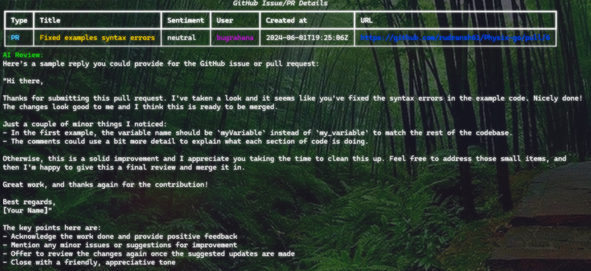

# GitHub Issues and PRs Sentiment Analysis with AI Reviews

```
  ___
 (o o)
(  V  )
--m-m--

```

This project analyzes GitHub issues and pull requests (PRs) sentiment using natural language processing techniques and generates AI-powered reviews using MindsDB's Gwmini model.

## Installation

### Prerequisites

- Python 3.7+
- Git
- GitHub API Token (with `repo` scope)
- MindsDB API Key

### Setup

1. Clone the repository:

   ```bash
   git clone https://github.com/rudransh61/github-sentimental-analysis
   cd your-repo
   ```

2. Install dependencies:

   ```bash
   pip install -r requirements.txt
   ```

3. Create a `.env` file in the root directory with the following variables:

   ```plaintext
   GITHUB_TOKEN=your-github-token
   MINDSDB_API_KEY=your-mindsdb-api-key
   ```

   Replace `your-github-token` and `your-mindsdb-api-key` with your actual tokens.

## Usage

### Command-line Interface (CLI)

Run the following command to analyze GitHub issues and PRs:

```bash
python main.py owner/repo
```

Replace `owner/repo` with the GitHub repository you want to analyze.

#### Options

- `--plot`: Only plot the sentiment analysis results.
- `--review <number>`: Generate a detailed review for a specific issue/PR by its number.

### Example



To analyze issues and PRs in the repository `rudransh61/Physix-go`:

```bash
python main.py rudransh61/Physix-go
```

This command will fetch all issues and PRs, perform sentiment analysis, generate AI reviews, and plot sentiment analysis results.

## Contributing

Contributions are welcome! Please fork the repository and create a pull request with your improvements. Ensure to follow the [Contributing Guidelines](CONTRIBUTING.md).

## License

This project is licensed under the MIT License - see the [LICENSE](LICENSE) file for details.
```

### Additional Files

- **CONTRIBUTING.md**: This file should contain guidelines for contributing to your project.
- **LICENSE**: Include the license terms for your project.
- **requirements.txt**: List all Python dependencies used in your project.

### Notes:

- Replace placeholders (`your-username`, `your-repo`, `your-github-token`, `your-mindsdb-api-key`) with actual values relevant to your setup.
- Ensure the `.env` file is not included in version control (add it to `.gitignore`).
- Customize the README.md to fit specific instructions or features unique to your project.

This README template provides a clear structure for users to understand how to install, configure, and use your GitHub sentiment analysis tool effectively. Adjust it based on your project's specific requirements and features.